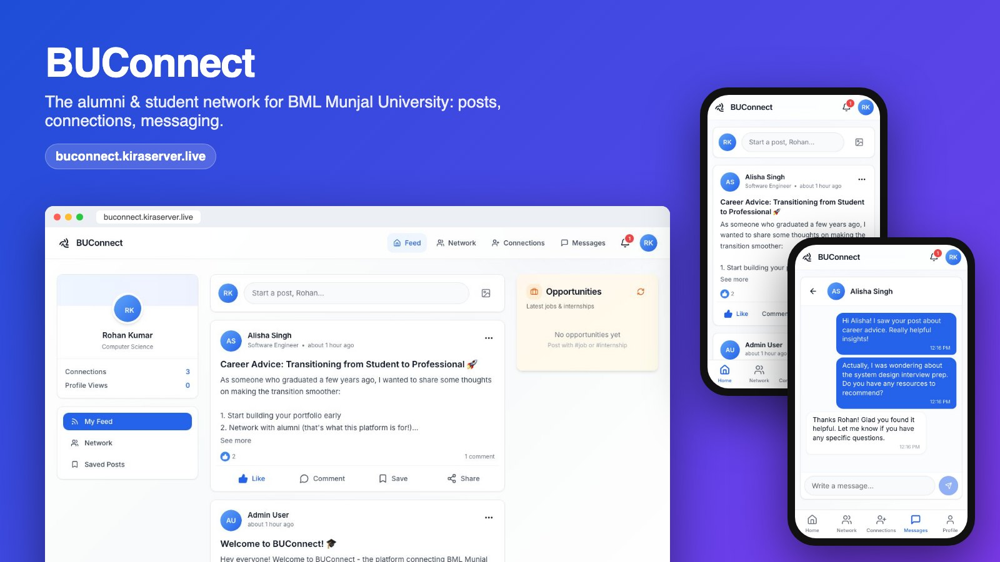
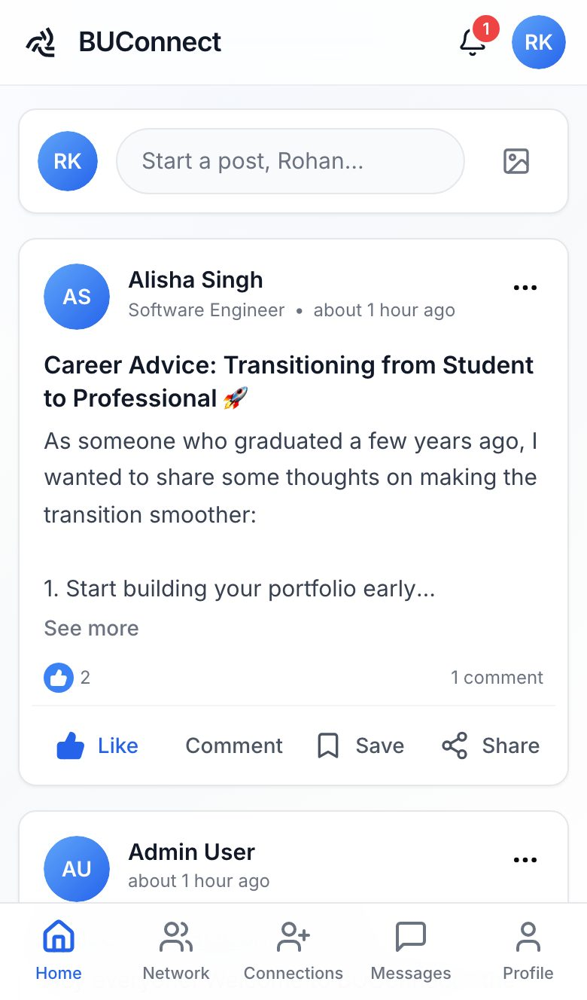
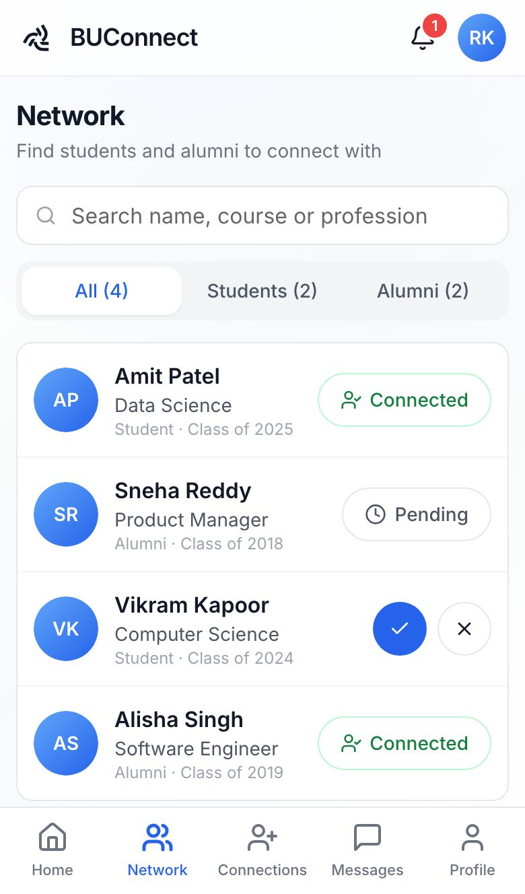
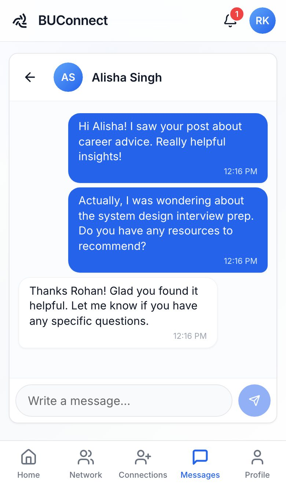
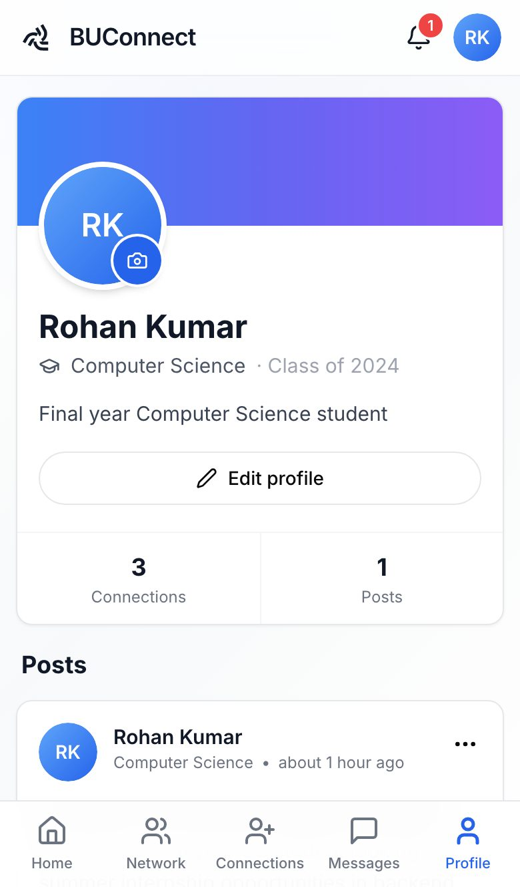
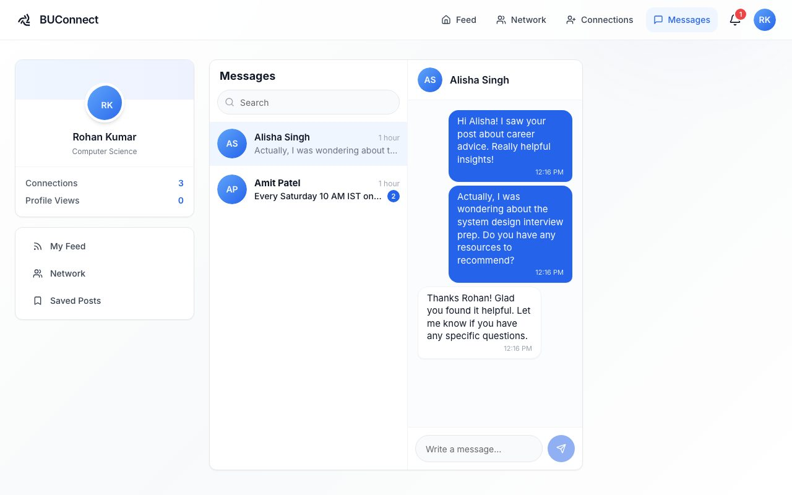
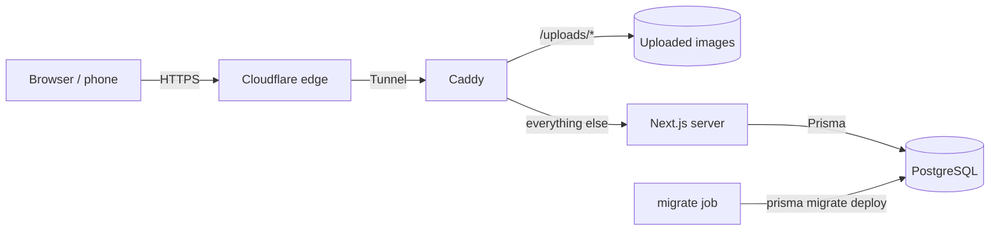

<div align="center">



# BUConnect

**A full-stack alumni & student network: share posts, build mutual connections, and message each other, on desktop and phone.**

[](https://buconnect.kiraserver.live)


</div>

## Try it

Open **[buconnect.kiraserver.live](https://buconnect.kiraserver.live)** and tap a demo account on the login screen. Works best on a phone.

| Role | Email | Password |
|---|---|---|
| Student | `rohan@example.com` | `password123` |
| Alumni | `alisha.s@example.com` | `password123` |

Demo accounts are shared and public, so please keep posts friendly.

## Features

**Feed**
- Create posts with an optional image link; long posts collapse behind *See more*
- Like, comment, save for later, and share (native share sheet on phones, copy link on desktop)
- Comments load on demand, so long feeds don't fire a request per post

**Network & connections**
- Directory of students and alumni with search and Student / Alumni filters
- Connection requests with accept / decline / withdraw; connections are **mutual** (stored in both directions in one transaction)
- Requesting someone who already requested you connects you instantly

**Messaging**
- One-to-one conversations with unread counts and live refresh
- Start a chat from any profile or connection, even with no previous messages
- Full-screen chat layout on phones with the message box pinned to the bottom

**Profiles & notifications**
- Profiles with role, course / profession, batch, bio and cropped profile photos
- Notifications for likes, comments, requests, acceptances and messages, each linking to the right place

**Mobile-first UI**
- Bottom tab bar on phones, top navigation from tablet up, three-column layout on desktop
- 44 px touch targets, 16 px inputs (no iOS zoom on focus), safe-area aware bottom bar

## Screenshots

<table>
  <tr>
    <td></td>
    <td></td>
    <td></td>
    <td></td>
  </tr>
  <tr align="center">
    <td>Feed</td><td>Network</td><td>Messages</td><td>Profile</td>
  </tr>
</table>



## Tech stack

| Layer | Technology |
|---|---|
| Framework | Next.js 16 (App Router, standalone output), React 18, TypeScript |
| UI | Tailwind CSS, shadcn/ui (Radix primitives), lucide icons |
| Data | PostgreSQL 16, Prisma ORM with versioned migrations |
| Auth | JWT session in an `httpOnly`, `Secure`, `SameSite=Lax` cookie (jose), bcrypt password hashes |
| Validation | Zod schemas (registration, posts, comments, profile edits) and explicit checks on the other write endpoints |
| Hosting | Docker Compose on a self-managed Ubuntu server, Caddy reverse proxy, Cloudflare Tunnel (TLS at the edge) |

## Architecture



- The app, the database and a one-shot migration job run as separate containers; the app starts only after migrations succeed.
- Caddy serves uploaded images directly (only image extensions, `nosniff`), everything else goes to Next.js.
- The database is never exposed outside the Docker network; the app port is bound to `127.0.0.1`.

## Security

- **Authorization on every route**: request lists are owner-only, connections are created only by the recipient accepting, posts can be deleted only by their author or an admin.
- **No self-assigned admin**: registration accepts only `STUDENT` / `ALUMNI`; admins are created out of band.
- **Upload hardening**: the image type is detected from the file's bytes and decides the extension, so a renamed HTML/SVG file can never be stored or served as a page.
- **Rate limiting** keyed on Cloudflare's `CF-Connecting-IP` (a spoofed `X-Forwarded-For` can't reset the limit).
- Member directory and connection lists require a session (they include emails).

## Getting started

**Prerequisites:** Node.js 20+ and Docker (or a local PostgreSQL 16).

```bash
git clone https://github.com/mrrobot-1001/Buconnect.git
cd Buconnect
npm install

cp .env.example .env            # then set JWT_SECRET (openssl rand -base64 32)
docker compose up -d db         # local PostgreSQL on :5432

npx prisma migrate deploy       # create the schema
npm run db:seed                 # optional demo users, posts and messages
npm run dev                     # http://localhost:9002
```

| Script | What it does |
|---|---|
| `npm run dev` | Development server on port 9002 |
| `npm run build` / `npm start` | Production build / server |
| `npm run typecheck` | TypeScript check |
| `npm run db:migrate` | Create a new migration from schema changes |
| `npm run db:studio` | Browse the database in Prisma Studio |

## Deployment

The [`Dockerfile`](Dockerfile) has two useful targets:

- `runner`: the slim production image (Next.js standalone server, non-root user)
- `builder`: has the Prisma CLI, used by a one-shot `prisma migrate deploy` container

A typical Compose setup runs `db` (postgres:16-alpine with a healthcheck) → `migrate` (`builder` target) → `app` (`runner` target, with a volume on `public/uploads`). Redeploying is `git pull && docker compose up -d --build`; nightly `pg_dump` backups cover the database and uploads.

## Project structure

```
prisma/
  schema.prisma          data model (users, posts, comments, likes, connections, messages, …)
  migrations/            versioned SQL migrations
  seed.ts                demo data
src/
  app/                   pages (feed, network, connections, messaging, profile, …)
  app/api/               route handlers (auth, posts, connections, messages, notifications, upload)
  components/            UI (AppLayout, MobileNav, PostCard, …) and shadcn/ui primitives
  lib/                   auth, Prisma client, connection rules, rate limiter
docs/screenshots/        images used in this README
```

## API overview

| Endpoint | Methods | Notes |
|---|---|---|
| `/api/auth/register`, `/login`, `/logout`, `/me` | POST / GET | Cookie session |
| `/api/posts`, `/api/posts/[id]` | GET, POST, DELETE | Paginated feed, author-only delete |
| `/api/posts/[id]/like`, `/save`, `/comments` | POST, GET | Toggles and comments |
| `/api/posts/saved` | GET | Current user's saved posts |
| `/api/connections/requests` | GET, POST, PATCH, DELETE | Send / accept / reject / withdraw / disconnect |
| `/api/messages` | GET, POST | Conversations and threads |
| `/api/notifications` | GET, PATCH, DELETE | Mark read, remove |
| `/api/users`, `/api/users/[id]` | GET | Directory and profiles (login required) |

---

Built by **Harsh Rana** · [@mrrobot-1001](https://github.com/mrrobot-1001)
